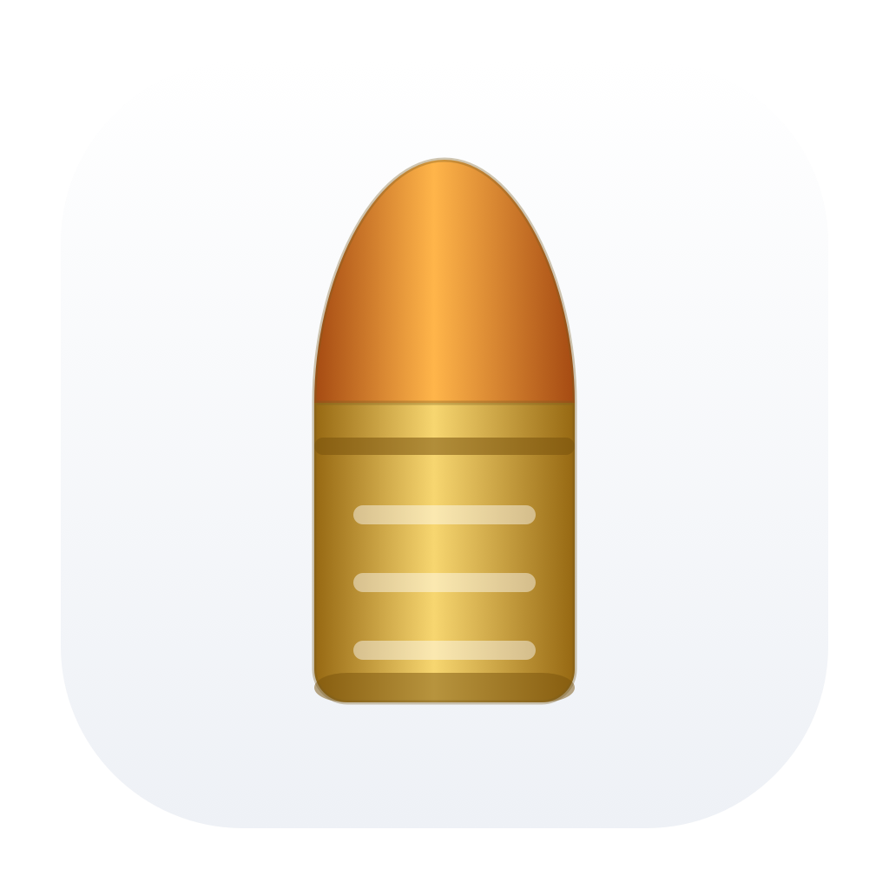
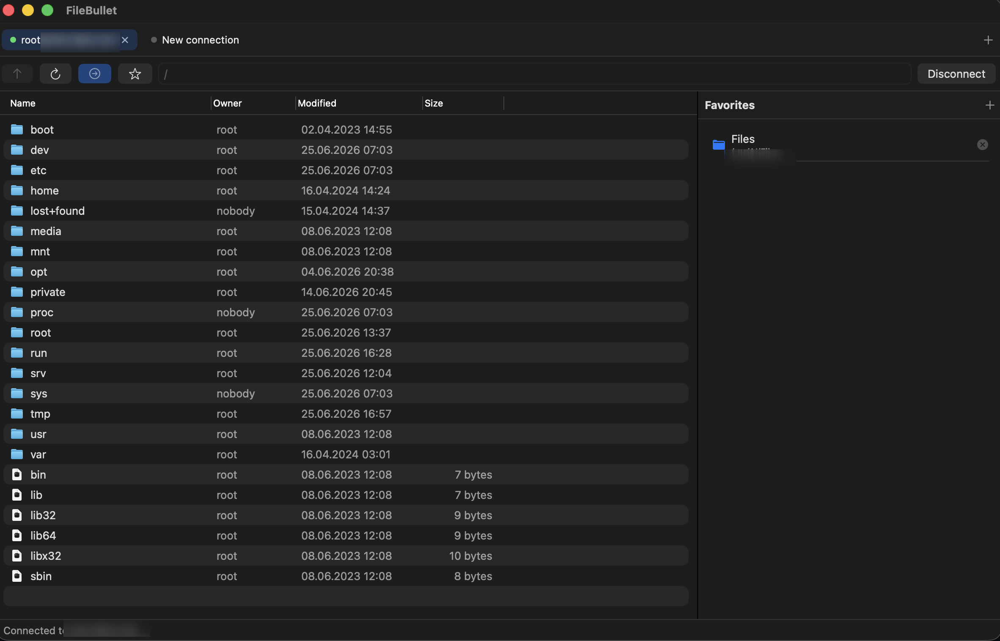
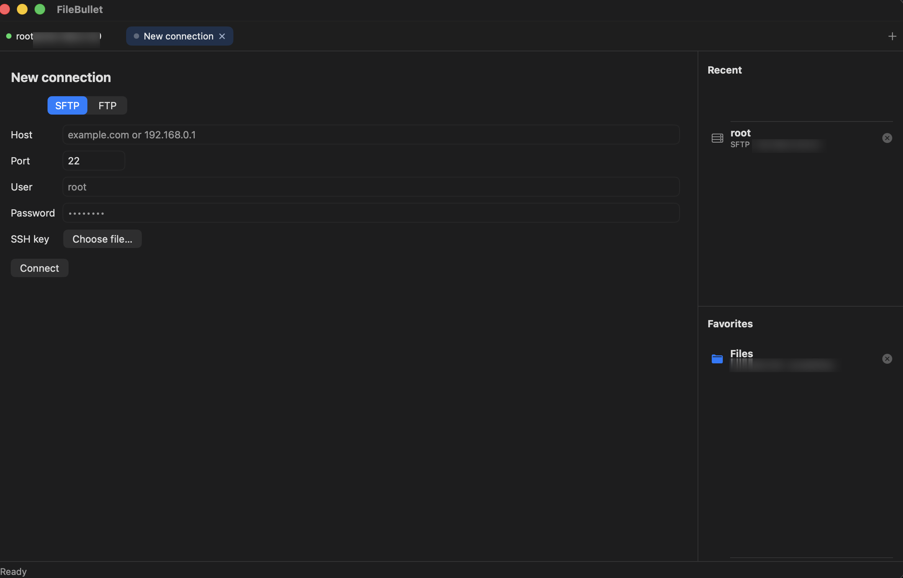

# FileBullet

[](https://github.com/timdev4dev/FileBullet/actions/workflows/ci.yml)
[](https://github.com/timdev4dev/FileBullet/actions/workflows/release.yml)
[](https://github.com/timdev4dev/FileBullet/releases/latest)

A fast, native **SFTP / FTP client for macOS**, built with SwiftUI. Browse remote
servers, edit files in your favourite editor with automatic upload-on-save,
manage permissions, and move files around — all from a clean, Finder-like UI.

<p align="center"></p>

## About

I built and polished FileBullet in a single day as part of my "one day, one
project" challenge. I'm a backend developer, and the goal was to make a free,
native alternative to the existing FTP/SFTP clients for macOS.

## Screenshots

| Browsing a server | New connection |
| --- | --- |
|  |  |

## Install

Download the latest build from the [**Releases**](https://github.com/timdev4dev/FileBullet/releases/latest) page:

- **`FileBullet.dmg`** — open it and drag **FileBullet** into **Applications**.
- **`FileBullet.zip`** — unzip and move the app wherever you like.

The app is **ad-hoc signed** (not notarized), so on first launch macOS Gatekeeper
will warn you. Right-click the app → **Open** → **Open** once, and it runs
normally afterwards.

Requires **macOS 14 (Sonoma)** or later. Apple Silicon and Intel.

## Features

### Connections
- **Two protocols:** **SFTP** (over SSH) and plain **FTP**, selectable per tab.
- **Authentication:** password, or **SSH private key** for SFTP
  (ed25519 and ECDSA P-256 / P-384 / P-521, unencrypted OpenSSH keys).
- **Tabs:** connect to several servers at once. `⌘T` new tab, `⌘W` close tab.
- **Recent connections:** host, port, user, protocol and key path are remembered;
  passwords are stored in the **macOS Keychain** (never in plain text).
  One click reconnects.

### Browsing
- Columns for **Name, Owner, Modified, Size** with clickable, **sortable** headers
  and resizable widths.
- **System file-type icons** (the same ones Finder uses).
- Instant single-click selection and **multi-selection** (`⇧`-click for a range,
  `⌘`-click to toggle).
- Double-click a folder to enter, a file to open. `Enter` opens the selection.

### File operations (right-click menu)
- **Open** / **Open With…** (submenu of apps that handle the file type).
- **Download…** — single files or whole folders (recursive), and **bulk download**
  of a multi-selection into a chosen folder.
- **Copy Path(s)** to the clipboard.
- **Duplicate** (server-side copy, recursive for folders).
- **Rename** — in place, Finder-style.
- **Permissions…** — a `chmod` editor with rwx checkboxes and an octal field.
- **Delete** — single or bulk, with confirmation; folders are removed recursively.
- **Add to Favorites** for folders, and **Refresh**.

### Editing
- Open a remote file in your **external editor** (default app or a chosen one).
- **Automatic upload on save:** the local copy is watched, and any change is pushed
  back to the server automatically.
- Per-file **sync status**: a badge on the file icon (uploading / uploaded / error)
  plus an "editing files" panel with manual save, reveal and reopen.

### Transfers
- **Drag & drop upload** from Finder into the current folder, with a **byte-level
  progress bar**, **cancel** (interrupts mid-file), and automatic cleanup of a
  partially-uploaded file on cancel. Folders upload recursively.
- Downloads of files and folders via a save panel.

### Favorites
- Bookmark any folder; favorites are kept **per host** and persist across launches.
- Shown in a right sidebar while browsing and on the connection screen.
- One click jumps to a favorite — and from the connection screen it will
  reconnect (using saved credentials) and navigate there.

### Terminal (SFTP)
- A real **VT/xterm terminal** in a resizable bottom panel, running an
  interactive SSH shell over the same connection — `vim`, `htop`, colors,
  window resize and clipboard all work.
- The session survives switching tabs; closing the panel or disconnecting ends it.
- On macOS 14 this falls back to a simple one-shot command console.

### More
- **Copy / Paste** files and folders elsewhere on the server, **Cut/Undo (⌘Z)**,
  create **new folders/files**, **rename** in place, **chmod & chown**,
  multi-select with bulk actions, an in-folder **search** filter, and
  **⌘⌫** to delete. Idle SSH connections are kept alive and auto-reconnect.

### Localization
- UI in **English (default), Russian, German and Spanish**, following the system
  language and falling back to English.

## Build from source

```sh
swift run            # build & run for development
./make-app.sh        # build a release FileBullet.app you can double-click
```

The icon is generated by `icon/make-icon.swift` and bundled as `icon/FileBullet.icns`.

## Architecture

The UI talks to a small `Backend` protocol, so the rest of the app is
protocol-agnostic:

- **`SFTPBackend`** — SSH/SFTP via [Citadel](https://github.com/orlandos-nl/Citadel)
  (pure-Swift, SwiftNIO). Chunked uploads with progress and cancellation.
- **`FTPBackend`** — plain FTP via the system `curl` binary (listing, transfers,
  `RNFR/RNTO`, `DELE`, `RMD`, `MKD`, `SITE CHMOD`).

The file list is a native `NSTableView` (wrapped in SwiftUI) for instant
selection, real double-click actions, sortable columns and context menus. The
terminal is [SwiftTerm](https://github.com/migueldeicaza/SwiftTerm) bound to an
SSH PTY via Citadel's `withPTY`.

## Releases (CI/CD)

GitHub Actions automate everything:

- **CI** runs `swift build` on every push and pull request.
- **Release** runs on every `v*` tag: it builds `FileBullet.app`, packages a
  `.dmg` and a `.zip`, and publishes a GitHub Release with generated notes.

Cut a new release with:

```sh
git tag v1.2.0 && git push origin v1.2.0
```

## Security notes

- Passwords live in the macOS Keychain; only host/port/user metadata is stored
  in `UserDefaults`.
- The SSH host key is currently accepted without verification
  (`.acceptAnything()`) — intended for trusted/personal servers.

## Limitations / roadmap

- **FTPS** (FTP over TLS) is not implemented yet — plain FTP only.
- **RSA** and **passphrase-protected** SSH keys are not supported yet
  (use an unencrypted ed25519/ECDSA key, e.g. `ssh-keygen -t ed25519`).
- The app is ad-hoc signed; **Developer ID signing + notarization** would remove
  the Gatekeeper prompt (needs an Apple Developer certificate).

## License

MIT — see [LICENSE](LICENSE).
